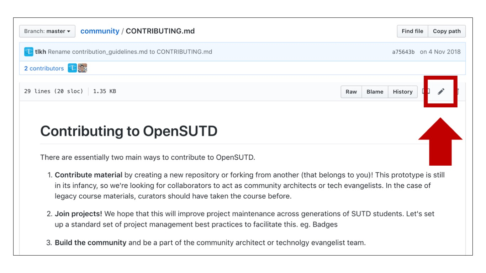
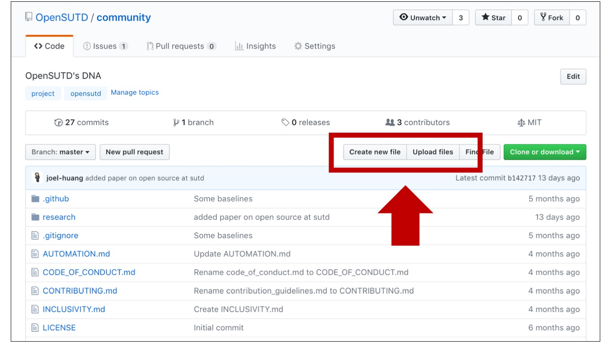

## Detailed guide on contributing

### 1. One-off contributions to existing project

If you would like to contribute a change to one particular file (e.g. this markdown file), you can simply click on the pencil icon at the top right-hand corner to open up a browser-based editor to make the changes.



Of, if you would like to add a new file, click on the "Create new file" button when in a folder view. 



Then fill in the small form below the editor with some descriptions about the changes you made, and submit a Pull Request for approval. You will be able to follow the progess on the repository's "Pull Requests" tab.

### 2. Contributing a new project

```
TODO
```